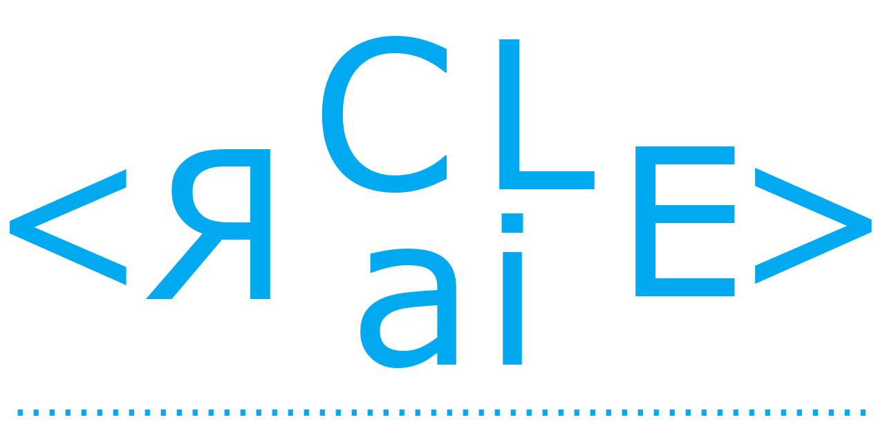

claire
=================

Command Line AI Request Experience




[](https://oclif.io)
[](https://npmjs.org/package/claire)
[](https://npmjs.org/package/claire)


<!-- toc -->
* [Usage](#usage)
* [Commands](#commands)
<!-- tocstop -->
# Usage
<!-- usage -->
```sh-session
$ npm install -g @claire-ac/cli
$ claire COMMAND
running command...
$ claire (--version)
@claire-ac/cli/0.2.0 darwin-arm64 node-v22.14.0
$ claire --help [COMMAND]
USAGE
  $ claire COMMAND
...
```
<!-- usagestop -->
# Commands
<!-- commands -->
* [`claire api:invitation:create [EMAIL]`](#claire-apiinvitationcreate-email)
* [`claire api:invitation:list`](#claire-apiinvitationlist)
* [`claire api:project:create`](#claire-apiprojectcreate)
* [`claire api:project:set`](#claire-apiprojectset)
* [`claire api:project:show [PROJECTID]`](#claire-apiprojectshow-projectid)
* [`claire api:project:update`](#claire-apiprojectupdate)
* [`claire api:question:show [QUESTIONID]`](#claire-apiquestionshow-questionid)
* [`claire ask`](#claire-ask)
* [`claire config`](#claire-config)
* [`claire help [COMMAND]`](#claire-help-command)
* [`claire info`](#claire-info)
* [`claire init`](#claire-init)
* [`claire plugins`](#claire-plugins)
* [`claire plugins:add PLUGIN`](#claire-pluginsadd-plugin)
* [`claire plugins:inspect PLUGIN...`](#claire-pluginsinspect-plugin)
* [`claire plugins:install PLUGIN`](#claire-pluginsinstall-plugin)
* [`claire plugins:link PATH`](#claire-pluginslink-path)
* [`claire plugins:remove [PLUGIN]`](#claire-pluginsremove-plugin)
* [`claire plugins:reset`](#claire-pluginsreset)
* [`claire plugins:uninstall [PLUGIN]`](#claire-pluginsuninstall-plugin)
* [`claire plugins:unlink [PLUGIN]`](#claire-pluginsunlink-plugin)
* [`claire plugins:update`](#claire-pluginsupdate)

## `claire api:invitation:create [EMAIL]`

Send CLaiRE invitation to a new user.

```
USAGE
  $ claire api:invitation:create [EMAIL]

ARGUMENTS
  EMAIL  Email of the user to invite to CLaiRE

DESCRIPTION
  Send CLaiRE invitation to a new user.
```

_See code: [src/commands/api/invitation/create.ts](https://github.com/netuoso/CLaiRE/blob/v0.2.0/src/commands/api/invitation/create.ts)_

## `claire api:invitation:list`

Show sent CLaiRE invitations.

```
USAGE
  $ claire api:invitation:list

DESCRIPTION
  Show sent CLaiRE invitations.
```

_See code: [src/commands/api/invitation/list.ts](https://github.com/netuoso/CLaiRE/blob/v0.2.0/src/commands/api/invitation/list.ts)_

## `claire api:project:create`

Create new project in CLaiRE API

```
USAGE
  $ claire api:project:create [--name <value>] [--description <value>]

FLAGS
  --description=<value>  Project description
  --name=<value>         Project name

DESCRIPTION
  Create new project in CLaiRE API
```

_See code: [src/commands/api/project/create.ts](https://github.com/netuoso/CLaiRE/blob/v0.2.0/src/commands/api/project/create.ts)_

## `claire api:project:set`

List users projects and set active project in CLaiRE config.

```
USAGE
  $ claire api:project:set

DESCRIPTION
  List users projects and set active project in CLaiRE config.
```

_See code: [src/commands/api/project/set.ts](https://github.com/netuoso/CLaiRE/blob/v0.2.0/src/commands/api/project/set.ts)_

## `claire api:project:show [PROJECTID]`

Show information for CLaiRE project

```
USAGE
  $ claire api:project:show [PROJECTID] [--list] [-p <value>]

ARGUMENTS
  PROJECTID  ID of project to display

FLAGS
  -p, --projectId=<value>  ID of project to display
      --list               List projects and select to view

DESCRIPTION
  Show information for CLaiRE project
```

_See code: [src/commands/api/project/show.ts](https://github.com/netuoso/CLaiRE/blob/v0.2.0/src/commands/api/project/show.ts)_

## `claire api:project:update`

Update project information in CLaiRE API

```
USAGE
  $ claire api:project:update

DESCRIPTION
  Update project information in CLaiRE API
```

_See code: [src/commands/api/project/update.ts](https://github.com/netuoso/CLaiRE/blob/v0.2.0/src/commands/api/project/update.ts)_

## `claire api:question:show [QUESTIONID]`

Show details for CLaiRE question

```
USAGE
  $ claire api:question:show [QUESTIONID] [--list] [-q <value>] [-s]

ARGUMENTS
  QUESTIONID  ID of question to display

FLAGS
  -q, --questionId=<value>  ID of question to display
  -s, --skipResponse        Do not include question response in output
      --list                List questions and select to view

DESCRIPTION
  Show details for CLaiRE question
```

_See code: [src/commands/api/question/show.ts](https://github.com/netuoso/CLaiRE/blob/v0.2.0/src/commands/api/question/show.ts)_

## `claire ask`

Send a prompt to CLaiRE API and retrieve a response.

```
USAGE
  $ claire ask [-p <value>] [-F <value>...] [-c <value>...]

FLAGS
  -F, --inputFile=<value>...   Path to file(s) containing the question input
  -c, --contextIds=<value>...  Comma-separated list of context IDs
  -p, --prompt=<value>         Prompt to send

DESCRIPTION
  Send a prompt to CLaiRE API and retrieve a response.

EXAMPLES
  $ claire ask -p "How do I add ActiveAdmin to a Rails 7 app?"

  $ claire ask -p "Refactor this file" -F path/to/src/file.ts

  $ claire ask -F path/to/input.txt

  $ claire ask -p "Help me combine these files:" -F path/to/file1.ts -F path/to/file2.ts

  $ claire ask -p "Analyze this code" -c 123 -c 456
```

_See code: [src/commands/ask.ts](https://github.com/netuoso/CLaiRE/blob/v0.2.0/src/commands/ask.ts)_

## `claire config`

View current or set new CLaiRE configuration values.

```
USAGE
  $ claire config [-h <value>] [-t <value>]

FLAGS
  -h, --host=<value>   Set API base URL
  -t, --token=<value>  Set CLaiRE API key

DESCRIPTION
  View current or set new CLaiRE configuration values.
```

_See code: [src/commands/config.ts](https://github.com/netuoso/CLaiRE/blob/v0.2.0/src/commands/config.ts)_

## `claire help [COMMAND]`

Display help for claire.

```
USAGE
  $ claire help [COMMAND...] [-n]

ARGUMENTS
  COMMAND...  Command to show help for.

FLAGS
  -n, --nested-commands  Include all nested commands in the output.

DESCRIPTION
  Display help for claire.
```

_See code: [@oclif/plugin-help](https://github.com/oclif/plugin-help/blob/v6.2.25/src/commands/help.ts)_

## `claire info`

Display current project and configuration information.

```
USAGE
  $ claire info

DESCRIPTION
  Display current project and configuration information.
```

_See code: [src/commands/info.ts](https://github.com/netuoso/CLaiRE/blob/v0.2.0/src/commands/info.ts)_

## `claire init`

Initialize CLaiRE CLI.

```
USAGE
  $ claire init

DESCRIPTION
  Initialize CLaiRE CLI.
```

_See code: [src/commands/init.ts](https://github.com/netuoso/CLaiRE/blob/v0.2.0/src/commands/init.ts)_

## `claire plugins`

List installed plugins.

```
USAGE
  $ claire plugins [--json] [--core]

FLAGS
  --core  Show core plugins.

GLOBAL FLAGS
  --json  Format output as json.

DESCRIPTION
  List installed plugins.

EXAMPLES
  $ claire plugins
```

_See code: [@oclif/plugin-plugins](https://github.com/oclif/plugin-plugins/blob/v5.4.31/src/commands/plugins/index.ts)_

## `claire plugins:add PLUGIN`

Installs a plugin into claire.

```
USAGE
  $ claire plugins:add PLUGIN... [--json] [-f] [-h] [-s | -v]

ARGUMENTS
  PLUGIN...  Plugin to install.

FLAGS
  -f, --force    Force npm to fetch remote resources even if a local copy exists on disk.
  -h, --help     Show CLI help.
  -s, --silent   Silences npm output.
  -v, --verbose  Show verbose npm output.

GLOBAL FLAGS
  --json  Format output as json.

DESCRIPTION
  Installs a plugin into claire.

  Uses npm to install plugins.

  Installation of a user-installed plugin will override a core plugin.

  Use the CLAIRE_NPM_LOG_LEVEL environment variable to set the npm loglevel.
  Use the CLAIRE_NPM_REGISTRY environment variable to set the npm registry.

ALIASES
  $ claire plugins:add

EXAMPLES
  Install a plugin from npm registry.

    $ claire plugins:add myplugin

  Install a plugin from a github url.

    $ claire plugins:add https://github.com/someuser/someplugin

  Install a plugin from a github slug.

    $ claire plugins:add someuser/someplugin
```

## `claire plugins:inspect PLUGIN...`

Displays installation properties of a plugin.

```
USAGE
  $ claire plugins:inspect PLUGIN...

ARGUMENTS
  PLUGIN...  [default: .] Plugin to inspect.

FLAGS
  -h, --help     Show CLI help.
  -v, --verbose

GLOBAL FLAGS
  --json  Format output as json.

DESCRIPTION
  Displays installation properties of a plugin.

EXAMPLES
  $ claire plugins:inspect myplugin
```

_See code: [@oclif/plugin-plugins](https://github.com/oclif/plugin-plugins/blob/v5.4.31/src/commands/plugins/inspect.ts)_

## `claire plugins:install PLUGIN`

Installs a plugin into claire.

```
USAGE
  $ claire plugins:install PLUGIN... [--json] [-f] [-h] [-s | -v]

ARGUMENTS
  PLUGIN...  Plugin to install.

FLAGS
  -f, --force    Force npm to fetch remote resources even if a local copy exists on disk.
  -h, --help     Show CLI help.
  -s, --silent   Silences npm output.
  -v, --verbose  Show verbose npm output.

GLOBAL FLAGS
  --json  Format output as json.

DESCRIPTION
  Installs a plugin into claire.

  Uses npm to install plugins.

  Installation of a user-installed plugin will override a core plugin.

  Use the CLAIRE_NPM_LOG_LEVEL environment variable to set the npm loglevel.
  Use the CLAIRE_NPM_REGISTRY environment variable to set the npm registry.

ALIASES
  $ claire plugins:add

EXAMPLES
  Install a plugin from npm registry.

    $ claire plugins:install myplugin

  Install a plugin from a github url.

    $ claire plugins:install https://github.com/someuser/someplugin

  Install a plugin from a github slug.

    $ claire plugins:install someuser/someplugin
```

_See code: [@oclif/plugin-plugins](https://github.com/oclif/plugin-plugins/blob/v5.4.31/src/commands/plugins/install.ts)_

## `claire plugins:link PATH`

Links a plugin into the CLI for development.

```
USAGE
  $ claire plugins:link PATH [-h] [--install] [-v]

ARGUMENTS
  PATH  [default: .] path to plugin

FLAGS
  -h, --help          Show CLI help.
  -v, --verbose
      --[no-]install  Install dependencies after linking the plugin.

DESCRIPTION
  Links a plugin into the CLI for development.

  Installation of a linked plugin will override a user-installed or core plugin.

  e.g. If you have a user-installed or core plugin that has a 'hello' command, installing a linked plugin with a 'hello'
  command will override the user-installed or core plugin implementation. This is useful for development work.


EXAMPLES
  $ claire plugins:link myplugin
```

_See code: [@oclif/plugin-plugins](https://github.com/oclif/plugin-plugins/blob/v5.4.31/src/commands/plugins/link.ts)_

## `claire plugins:remove [PLUGIN]`

Removes a plugin from the CLI.

```
USAGE
  $ claire plugins:remove [PLUGIN...] [-h] [-v]

ARGUMENTS
  PLUGIN...  plugin to uninstall

FLAGS
  -h, --help     Show CLI help.
  -v, --verbose

DESCRIPTION
  Removes a plugin from the CLI.

ALIASES
  $ claire plugins:unlink
  $ claire plugins:remove

EXAMPLES
  $ claire plugins:remove myplugin
```

## `claire plugins:reset`

Remove all user-installed and linked plugins.

```
USAGE
  $ claire plugins:reset [--hard] [--reinstall]

FLAGS
  --hard       Delete node_modules and package manager related files in addition to uninstalling plugins.
  --reinstall  Reinstall all plugins after uninstalling.
```

_See code: [@oclif/plugin-plugins](https://github.com/oclif/plugin-plugins/blob/v5.4.31/src/commands/plugins/reset.ts)_

## `claire plugins:uninstall [PLUGIN]`

Removes a plugin from the CLI.

```
USAGE
  $ claire plugins:uninstall [PLUGIN...] [-h] [-v]

ARGUMENTS
  PLUGIN...  plugin to uninstall

FLAGS
  -h, --help     Show CLI help.
  -v, --verbose

DESCRIPTION
  Removes a plugin from the CLI.

ALIASES
  $ claire plugins:unlink
  $ claire plugins:remove

EXAMPLES
  $ claire plugins:uninstall myplugin
```

_See code: [@oclif/plugin-plugins](https://github.com/oclif/plugin-plugins/blob/v5.4.31/src/commands/plugins/uninstall.ts)_

## `claire plugins:unlink [PLUGIN]`

Removes a plugin from the CLI.

```
USAGE
  $ claire plugins:unlink [PLUGIN...] [-h] [-v]

ARGUMENTS
  PLUGIN...  plugin to uninstall

FLAGS
  -h, --help     Show CLI help.
  -v, --verbose

DESCRIPTION
  Removes a plugin from the CLI.

ALIASES
  $ claire plugins:unlink
  $ claire plugins:remove

EXAMPLES
  $ claire plugins:unlink myplugin
```

## `claire plugins:update`

Update installed plugins.

```
USAGE
  $ claire plugins:update [-h] [-v]

FLAGS
  -h, --help     Show CLI help.
  -v, --verbose

DESCRIPTION
  Update installed plugins.
```

_See code: [@oclif/plugin-plugins](https://github.com/oclif/plugin-plugins/blob/v5.4.31/src/commands/plugins/update.ts)_
<!-- commandsstop -->
